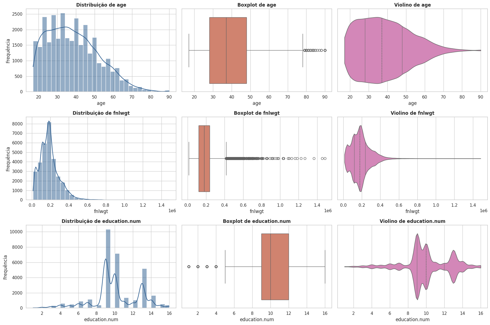
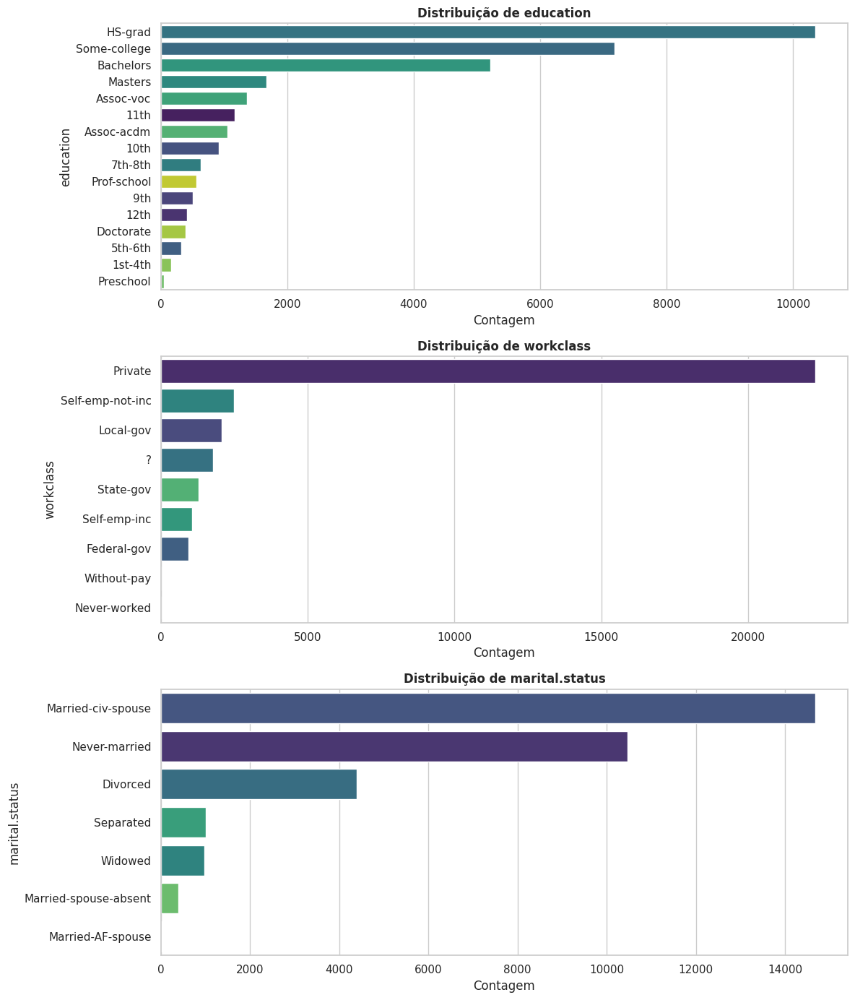

# 2. Análise Univariada

## Estatísticas descritivas das variáveis numéricas

```python
df[NUM].describe().T.round(2)
```

| Variável | count | mean | std | min | 25% | 50% | 75% | max |
|---|---|---|---|---|---|---|---|---|
| `age` | 31.947 | 38,57 | 13,65 | 17 | 28 | 37 | 48 | 90 |
| `fnlwgt` | 31.947 | 189.731,94 | 105.756,70 | 12.285 | 117.627,5 | 178.312 | 237.453,5 | 1.484.705 |
| `education.num` | 31.947 | 10,07 | 2,56 | 1 | 9 | 10 | 12 | 16 |

## Histogramas, boxplots e violinos (variáveis numéricas)

```python
sns.set_theme(style="whitegrid")
fig, axes = plt.subplots(3, 3, figsize=(18, 12))

for i, col in enumerate(NUM):
    sns.histplot(df[col], kde=True, ax=axes[i, 0], color="#2b5c8f", bins=30)
    sns.boxplot(x=df[col], ax=axes[i, 1], color="#e07a5f")
    sns.violinplot(df[col], ax=axes[i, 2], color="#e07abb", orient='h',
                   inner="quartile", cut=0, density_norm="width")

plt.tight_layout()
plt.show()
```



## Frequências e gráficos de barras (variáveis categóricas)

Análise limitada às três variáveis categóricas mais relevantes para o problema: `education`, `workclass` e `marital.status`.

```python
cols_cat_analise = ["education", "workclass", "marital.status"]

for col in cols_cat_analise:
    freq_table = pd.DataFrame({
        "Frequência Absoluta": df[col].value_counts(),
        "Frequência Relativa (%)": df[col].value_counts(normalize=True).mul(100).round(2),
    })
    display(freq_table)

fig, axes = plt.subplots(3, 1, figsize=(12, 14))
for i, col in enumerate(cols_cat_analise):
    order = df[col].value_counts().index
    sns.countplot(data=df, y=col, order=order, ax=axes[i], palette="viridis", hue=col, legend=False)
plt.tight_layout()
plt.show()
```



**Principais frequências observadas:**

- `education`: predominam `HS-grad` (32,40%), `Some-college` (22,47%) e `Bachelors` (16,30%).
- `workclass`: predomina fortemente `Private` (69,76%), seguido de `Self-emp-not-inc` (7,82%) e `Local-gov` (6,47%). A categoria `?` representa 5,57% (valores ausentes).
- `marital.status`: predominam `Married-civ-spouse` (45,94%) e `Never-married` (32,79%), seguidos de `Divorced` (13,76%).

## Interpretação dos resultados univariados

**Variáveis numéricas:**

- **`age`** — Apresenta leve assimetria à direita, com maior concentração de indivíduos entre 20 e 45 anos. Pelo critério do intervalo interquartil, idades acima de 78 anos são classificadas como outliers, mas são valores plausíveis e não devem ser removidos automaticamente.
- **`fnlwgt`** — Possui forte assimetria à direita e diversos valores extremos. Como representa o número estimado de pessoas semelhantes a cada registro, valores elevados não são necessariamente erros; por não ser uma característica individual, sua análise exige mais cautela que as demais variáveis.
- **`education.num`** — Apresenta distribuição discreta e multimodal, com maior concentração nos níveis 9 (`HS-grad`), 10 (`Some-college`) e 13 (`Bachelors`). Embora os níveis de 1 a 4 apareçam como outliers no boxplot, eles representam escolaridades válidas e menos frequentes; a variável deve ser interpretada como **ordinal**, não como uma medida contínua.

**Variáveis categóricas:**

- **`education`** — Maior concentração em `HS-grad`, `Some-college` e `Bachelors`, confirmando o padrão de `education.num`. Como ambas representam a escolaridade, existe **redundância** entre elas — utilizar apenas uma no modelo é suficiente.
- **`workclass`** — Amplamente dominada por `Private`, enquanto `Without-pay` e `Never-worked` são raras. A categoria `?` representa ausentes e será tratada como tal antes do treinamento.
- **`marital.status`** — Predominam `Married-civ-spouse` e `Never-married`, seguidas de `Divorced`. Algumas categorias têm poucos registros, o que pode dificultar o aprendizado de padrões específicos e justificar seu agrupamento, caso sejam conceitualmente semelhantes.
