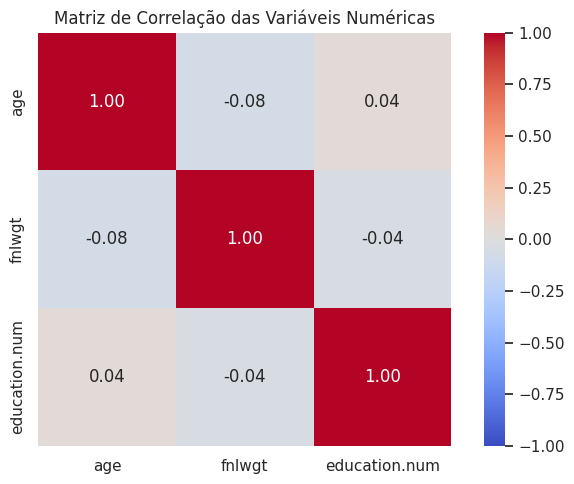
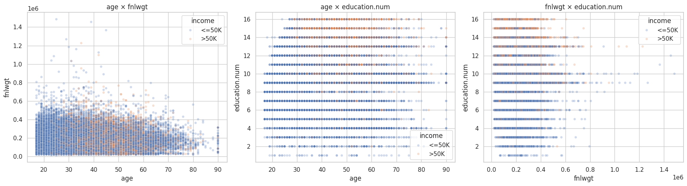
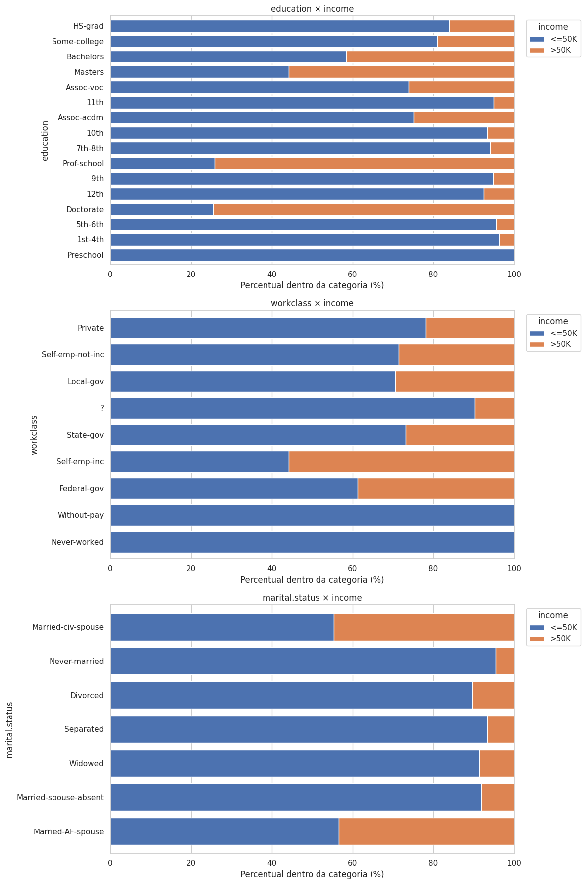
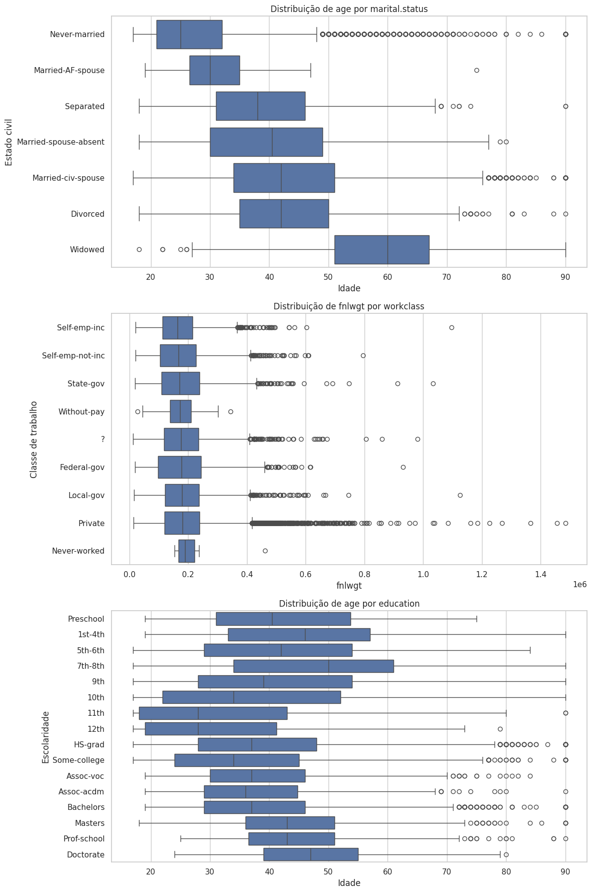

# 3. Análise Bivariada e Multivariada

## Correlações entre variáveis numéricas

```python
matriz_correlacao = df[NUM].corr(method="pearson")

plt.figure(figsize=(7, 5))
sns.heatmap(matriz_correlacao, annot=True, fmt=".2f", cmap="coolwarm", vmin=-1, vmax=1, square=True)
plt.title("Matriz de Correlação das Variáveis Numéricas")
plt.tight_layout()
plt.show()
```



```python
fig, axes = plt.subplots(1, 3, figsize=(18, 5))
pares = [("age", "fnlwgt"), ("age", "education.num"), ("fnlwgt", "education.num")]

for ax, (x, y) in zip(axes, pares):
    sns.scatterplot(data=df, x=x, y=y, alpha=0.25, s=20, ax=ax, hue='income')

plt.tight_layout()
plt.show()
```



Analisando as variáveis numéricas, verificam-se correlações lineares **muito fracas**, com coeficientes próximos de zero: **−0,08** entre `age` e `fnlwgt`, **0,04** entre `age` e `education.num` e **−0,04** entre `fnlwgt` e `education.num`. Os scatter plots também não apresentam tendências lineares claras, além de forte sobreposição de pontos decorrente do volume de observações e da natureza discreta de algumas variáveis.

Principais detalhes observados:

- Em `age × fnlwgt`, indivíduos com renda `>50K` aparecem com maior frequência nas idades intermediárias (aprox. 30–65 anos), enquanto `<=50K` está mais distribuído entre todas as idades. Nota-se também um aparente truncamento da distribuição aos 90 anos.
- Em `age × education.num`, os pontos formam linhas horizontais porque `education.num` assume apenas valores inteiros. Apesar da grande sobreposição entre classes, `>50K` aparece proporcionalmente mais entre adultos de idade intermediária e níveis educacionais mais altos.
- Em `fnlwgt × education.num`, repete-se o padrão já observado, com mais casos nos níveis 9, 10 e 13.
- O padrão de linhas/colunas ocorre porque `age` e `education.num` assumem valores inteiros por natureza ordinal e discreta.

Em síntese, a coloração por `income` revela diferenças mais perceptíveis em relação à idade e ao nível educacional, mas nenhuma variável numérica isolada separa completamente as classes de renda — os baixos coeficientes indicam apenas ausência de relações **lineares** fortes, não a inexistência de associação com `income`.

## Relações entre variáveis categóricas e o target `income`

```python
for variavel in cols_cat_analise:
    tabela_contagem = pd.crosstab(df[variavel], df["income"])
    tabela_percentual = pd.crosstab(df[variavel], df["income"], normalize="index").mul(100)
    tabela_percentual.plot(kind="barh", stacked=True, ax=ax, width=0.8)
```



As três variáveis possuem relação com `income`, mas em intensidades diferentes:

=== "education × income"
    Associação clara entre maior escolaridade e maior proporção de renda acima de 50 mil:

    - `Preschool`, `1st-4th`, `5th-6th` e níveis semelhantes: quase todos os casos em `<=50K`.
    - `Bachelors` já apresenta proporção relevante de `>50K`.
    - Em `Masters`, a classe `>50K` supera 50%.
    - `Doctorate` e `Prof-school` apresentam as maiores proporções de `>50K` (~74%).

    Isso indica que a escolaridade provavelmente será uma variável importante para o modelo.

=== "workclass × income"
    A proporção de `>50K` varia entre categorias:

    - `Self-emp-inc` possui a maior proporção de renda alta (55,9%).
    - `Federal-gov` também apresenta proporção relativamente elevada (38,7%).
    - `Private`, apesar de concentrar a maioria dos registros, tem proporção menor de `>50K` (21,9%).
    - `Without-pay` e `Never-worked` não apresentam casos de `>50K`, mas têm poucos registros.

    Percentuais de categorias raras são instáveis e não devem ser interpretados como regra absoluta — pode ser necessário agrupá-las em uma categoria `Other`.

=== "marital.status × income"
    Forte associação com o alvo:

    - `Married-civ-spouse` possui proporção consideravelmente maior de `>50K` (44,7%).
    - `Never-married` concentra quase todos os registros em `<=50K` (95,4%).
    - `Divorced`, `Separated`, `Widowed` e `Married-spouse-absent` também têm baixa proporção de renda alta.
    - `Married-AF-spouse` apresenta proporção elevada de `>50K`, mas é uma categoria rara.

    O gráfico mostra **associação, não causalidade** — parte dela pode estar ligada a outras características, como idade e ocupação.

## Relações entre variáveis numéricas e categóricas

```python
sns.boxplot(data=df, x="age", y="marital.status", order=ordem_marital, ax=axes[0])
sns.boxplot(data=df, x="fnlwgt", y="workclass", order=ordem_workclass, ax=axes[1])
sns.boxplot(data=df, x="age", y="education", order=ordem_education, ax=axes[2])
```



- **`age × marital.status`** — Diferenças claras: `Never-married` tende a ser mais jovem, `Widowed` apresenta a maior mediana de idade; `Married-civ-spouse`, `Divorced` e `Separated` concentram-se em faixas intermediárias. Associação relevante entre idade e estado civil, com sobreposição entre grupos.
- **`fnlwgt × workclass`** — Medianas e IQRs semelhantes entre a maioria das classes de trabalho, indicando pouca diferenciação. Os numerosos outliers (principalmente em `Private`) decorrem da assimetria de `fnlwgt` e do maior número de registros nessa categoria. Relação com pouca utilidade preditiva — reforça a decisão de não usar `fnlwgt` como feature no modelo inicial.
- **`age × education`** — Diferenças de idade entre níveis educacionais: `11th`, `12th` e `Some-college` têm medianas mais baixas, enquanto `Doctorate`, `Masters` e alguns níveis básicos têm medianas mais altas. Grande sobreposição entre grupos, sem progressão perfeitamente linear.

De forma geral, `age` apresenta relações relevantes com `marital.status` e `education`, enquanto `fnlwgt` pouco diferencia as classes de trabalho. Valores extremos observados nos boxplots não devem ser removidos automaticamente, pois podem representar observações válidas dentro de cada categoria.
