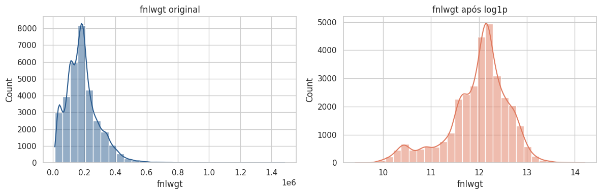
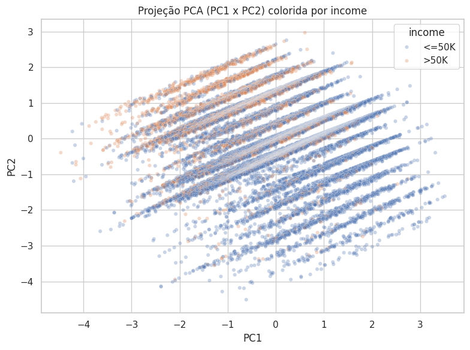

# 4. Pré-processamento para Modelagem

Com o EDA concluído, esta seção define as decisões de pré-processamento a serem aplicadas antes da modelagem, justificando cada escolha com base no que foi observado nas seções anteriores.

## Separação em treino e teste

Antes de aplicar qualquer etapa de pré-processamento (imputação, encoding, padronização, PCA para o pipeline final), os dados são separados em treino e teste. A ordem importa: a análise exploratória foi feita sobre o dataset completo (o que não é um problema, pois é apenas observação), mas a partir daqui são **ajustados** imputadores, encoders e `StandardScaler` — e esse ajuste não pode "enxergar" o conjunto de teste, senão estatísticas do teste (média, desvio padrão, categorias mais frequentes) vazariam para o treino (*data leakage*), inflando artificialmente a performance dos modelos nas fases seguintes.

Foi usado `stratify=y` para manter a mesma proporção de `income` em treino e teste, já que o desbalanceamento de classes foi identificado na [Seção 1](01-inspecao-inicial.md#desbalanceamento-de-classes) — sem estratificação, o split aleatório poderia acentuar ainda mais esse desbalanceamento em um dos conjuntos.

```python
from sklearn.model_selection import train_test_split

X_full = df.drop(columns=["income"])
y_full = df["income"]

X_train, X_test, y_train, y_test = train_test_split(
    X_full, y_full,
    test_size=0.2,
    random_state=42,
    stratify=y_full
)
```

## 4.1 Valores ausentes

Os ausentes estão codificados como `"?"` ou `"occupation"` e concentrados em três colunas categóricas: `workclass` (1.778), `occupation` (3.247) e `native.country` (25).

**Estratégia adotada:**

- Converter `"?"` e `"occupation"` para `NaN` explícito em todo o dataset, para que os ausentes sejam tratados como tal, e não como uma categoria de texto qualquer.
- `native.country`: **imputação pela moda** (`United-States`). São apenas 25 linhas (~0,08% do dataset), então o impacto de imputar pela categoria dominante é praticamente nulo, e descartar essas linhas seria perder dados sem necessidade.
- `workclass` e `occupation`: **não imputar pela moda**. Imputar tantas linhas pela categoria mais frequente (`Private` e `Craft-repair`) distorceria artificialmente essa distribuição. Em vez disso, cria-se uma **categoria explícita `"Missing"`**, preservando a informação de que o dado não foi informado — o que pode até ser um padrão relevante (ex: ausência de `occupation` tende a coincidir com ausência de `workclass`).
- **Não remover linhas com ausentes**: removê-las em `occupation` representaria mais de 10% do total, enviesando a amostra e reduzindo ainda mais a classe minoritária (`>50K`) do target.

```python
df_proc = df.copy()
df_proc = df_proc.replace(["?", "occupation"], pd.NA)
```

## 4.2 Outliers

Nenhuma das três variáveis numéricas deve ter outliers removidos automaticamente:

- `age`: valores altos são plausíveis biologicamente, refletindo apenas uma cauda longa natural da distribuição.
- `fnlwgt`: é um peso amostral definido pela metodologia do censo, não uma característica do indivíduo. Remover valores extremos comprometeria a representatividade da amostra.
- `education.num`: é uma variável ordinal e discreta. Os "outliers" no boxplot são apenas níveis de escolaridade raros (ex: `1st-4th`), não erros de medição.

**Decisão:** não remover outliers, mas **tratar a forte assimetria de `fnlwgt`** com transformação logarítmica (`log1p`), já que é a única variável cuja cauda extrema pode prejudicar modelos sensíveis a escala/distância (KNN, regressão logística) e o próprio PCA. `age` e `education.num` não precisam de transformação, por não apresentarem assimetria relevante o suficiente.

```python
fig, axes = plt.subplots(1, 2, figsize=(12, 4))
sns.histplot(df_proc["fnlwgt"], kde=True, ax=axes[0], color="#2b5c8f", bins=30)
sns.histplot(np.log1p(df_proc["fnlwgt"]), kde=True, ax=axes[1], color="#e07a5f", bins=30)
plt.tight_layout()
plt.show()
```



A transformação reduz visivelmente a assimetria à direita de `fnlwgt`, aproximando sua distribuição de uma forma mais simétrica, sem eliminar nenhuma observação.

## 4.3 Encoding de variáveis categóricas

A estratégia de encoding varia conforme a natureza de cada variável:

- **One-Hot Encoding** para `workclass`, `marital.status`, `occupation`, `relationship` e `race`. Nenhuma delas possui ordem natural entre categorias — usar Label Encoding introduziria uma relação ordinal falsa (ex: sugerir que `Widowed > Married`), prejudicando principalmente modelos lineares e baseados em distância.
- **`native.country`** recebe tratamento próprio: é imputada pela moda (`United-States`, conforme a [Seção 4.1](#41-valores-ausentes)) e, em seguida, suas categorias raras (frequência relativa abaixo de 1%, aprendida **apenas no treino**) são agrupadas em `"Other"` por um transformer customizado (`RareCategoryGrouper`) antes do one-hot — evitando explodir a dimensionalidade em colunas quase vazias, sem vazar informação do teste para o treino.
- **`sex`** é tratada como binária simples (0/1) via `OneHotEncoder(drop="if_binary")`, que gera uma única coluna em vez de duas colunas redundantes, já que é um caso particular de one-hot com apenas duas categorias.
- **`education` será descartada**, mantendo apenas `education.num`. Ambas carregam a mesma informação (nível de escolaridade), mas `education.num` já representa essa hierarquia de forma ordinal correta (1 = nível mais baixo). Fazer one-hot em `education` jogaria fora essa ordem, e recriar um encoding ordinal manual seria redundante.

!!! info "Correção aplicada"
    Na primeira versão do notebook, o texto já previa o agrupamento em `"Other"` e o encoding binário de `sex`, mas o código do pipeline ainda tratava as duas variáveis como categóricas genéricas (one-hot padrão, imputação por `"Missing"`). O trecho de código abaixo já reflete a versão corrigida, em que texto e implementação estão alinhados.

## 4.4 Normalização / padronização

**Standardization (Z-score)**, aplicada em `age`, `fnlwgt` (após o `log1p`) e `education.num`, em vez de Min-Max Scaling. Motivos:

- Standardization é mais robusto a outliers residuais que Min-Max, que depende diretamente do valor mínimo e máximo — um único valor extremo distorce a escala de todas as outras observações.
- O PCA (próxima etapa) exige dados centrados em zero e com variância comparável entre features. Min-Max não centra os dados, então Standardization é o pré-requisito mais adequado.
- Modelos baseados em árvore não são sensíveis à escala, mas como o pipeline deve servir para as fases de modelagem subsequentes (que provavelmente incluirão modelos lineares e baseados em distância), padronizar é a escolha mais segura para todos os casos.

## 4.5 e 4.6 Redução de dimensionalidade (PCA)

O PCA é aplicado apenas às três variáveis numéricas (`age`, `fnlwgt` com `log1p`, `education.num`), já padronizadas — a padronização precisa vir antes do PCA, já que `fnlwgt` tem escala muito maior que as demais e dominaria os componentes se não fosse ajustada primeiro.

```python
from sklearn.preprocessing import StandardScaler
from sklearn.decomposition import PCA

num_pca = df_proc[NUM].copy()
num_pca["fnlwgt"] = np.log1p(num_pca["fnlwgt"])

scaler_pca = StandardScaler()
num_pca_scaled = scaler_pca.fit_transform(num_pca)

pca = PCA()
componentes = pca.fit_transform(num_pca_scaled)
```

```text
Variância explicada por componente:  [0.364, 0.323, 0.313]
Variância explicada acumulada:       [0.364, 0.687, 1.000]
```

```python
pca_df = pd.DataFrame(componentes[:, :2], columns=["PC1", "PC2"])
pca_df["income"] = df_proc["income"].values

sns.scatterplot(data=pca_df, x="PC1", y="PC2", hue="income", alpha=0.3, s=20)
plt.title("Projeção PCA (PC1 x PC2) colorida por income")
plt.show()
```



**Importância das features (loadings):** como as três variáveis numéricas têm correlação praticamente nula entre si ([ver Seção 3](03-analise-bivariada-multivariada.md#correlacoes-entre-variaveis-numericas)), era esperado que cada componente principal ficasse dominado por uma única variável, em vez de misturar várias com pesos parecidos — o que de fato acontece: cada PC concentra a maior parte do seu peso em uma das três variáveis, com contribuição pequena das outras duas. Isso confirma, do ponto de vista dos coeficientes (e não só da variância explicada), que **não existe uma combinação linear das numéricas que sintetize bem a informação das três ao mesmo tempo** — cada uma carrega um pedaço de informação relativamente independente das demais.

**Análise dos resultados:** como já era esperado a partir da matriz de correlação (coeficientes próximos de zero), a variância explicada tende a ficar mais distribuída entre os componentes, em vez de se concentrar no PC1 — ou seja, não há redundância forte a comprimir entre essas três variáveis, e a redução de dimensionalidade não gera muito ganho prático em termos de compactação de informação.

O valor do PCA aqui está mais na **visualização** do que na redução de features propriamente dita: ao plotar PC1 × PC2 colorido por `income`, observa-se uma separação **parcial, não limpa**, coerente com o que já havia aparecido nos scatter plots da análise bivariada — há uma tendência de `>50K` se concentrar em certas regiões (idade intermediária, `education.num` mais alto), mas com sobreposição considerável entre as classes.

!!! warning "Implicação para a modelagem"
    Nenhuma variável numérica isolada, nem sua combinação linear via PCA, separa bem as classes de renda. A separação provavelmente vai depender mais das variáveis categóricas (`marital.status`, `education.num`, `occupation`) do que das numéricas isoladamente.

## 4.7 Pipeline de pré-processamento

Reunindo todas as decisões acima em um único pipeline com `Pipeline` e `ColumnTransformer`, garantindo que o mesmo tratamento (mesma imputação, mesmo scaler, mesmas colunas de one-hot) seja aplicado de forma idêntica em treino e teste — o `fit` ocorre apenas no treino, evitando *data leakage*.

```python
from sklearn.pipeline import Pipeline
from sklearn.compose import ColumnTransformer
from sklearn.impute import SimpleImputer
from sklearn.preprocessing import OneHotEncoder, FunctionTransformer
from sklearn.base import BaseEstimator, TransformerMixin

# Features finais consideradas no pipeline
num_features = ["age", "fnlwgt", "education.num"]
cat_features = ["workclass", "marital.status", "occupation", "relationship", "race"]
# "education" é descartada por redundância com "education.num"
# "sex" e "native.country" recebem tratamento próprio (ver abaixo), por isso
# não entram em cat_features


class RareCategoryGrouper(BaseEstimator, TransformerMixin):
    """
    Agrupa em uma categoria 'Other' as categorias cuja frequência relativa,
    aprendida no TREINO (fit), fica abaixo de `threshold`. Evita explodir a
    dimensionalidade do one-hot com colunas quase vazias (ex: países raros
    em native.country), sem vazar informação do teste para o treino: as
    categorias consideradas "frequentes" são decididas só com X_train.
    """

    def __init__(self, threshold=0.01, other_label="Other"):
        self.threshold = threshold
        self.other_label = other_label

    def fit(self, X, y=None):
        X = pd.DataFrame(X)
        self.frequent_categories_ = {
            col: X[col].value_counts(normalize=True)
                        .loc[lambda freq: freq >= self.threshold]
                        .index.tolist()
            for col in X.columns
        }
        return self

    def transform(self, X):
        X = pd.DataFrame(X).copy()
        for col in X.columns:
            frequentes = self.frequent_categories_[col]
            X[col] = X[col].where(X[col].isin(frequentes), self.other_label)
        return X

    def get_feature_names_out(self, input_features=None):
        return np.asarray(input_features)


# --- Pipeline para fnlwgt (log1p + padronização) ---
fnlwgt_pipeline = Pipeline([
    ("log", FunctionTransformer(np.log1p, feature_names_out="one-to-one")),
    ("scaler", StandardScaler())
])

# --- Pipeline para age e education.num (apenas padronização) ---
num_pipeline = Pipeline([
    ("scaler", StandardScaler())
])

# --- Pipeline para sex (encoding binário 0/1) ---
# drop="if_binary" faz o OneHotEncoder gerar uma única coluna 0/1 quando a
# variável tem só duas categorias, em vez de duas colunas redundantes.
sex_pipeline = Pipeline([
    ("onehot", OneHotEncoder(drop="if_binary", handle_unknown="ignore"))
])

# --- Pipeline para native.country (imputação pela moda, como decidido na
#     seção 4.1, + agrupamento de categorias raras em "Other" + one-hot) ---
native_country_pipeline = Pipeline([
    ("imputer", SimpleImputer(strategy="most_frequent")),
    ("group_rare", RareCategoryGrouper(threshold=0.01)),
    ("onehot", OneHotEncoder(handle_unknown="ignore"))
])

# --- Pipeline para as demais categóricas (imputação com categoria
#     explícita "Missing" + one-hot) ---
cat_pipeline = Pipeline([
    ("imputer", SimpleImputer(strategy="constant", fill_value="Missing")),
    ("onehot", OneHotEncoder(handle_unknown="ignore"))
])

preprocessor = ColumnTransformer([
    ("fnlwgt", fnlwgt_pipeline, ["fnlwgt"]),
    ("num", num_pipeline, ["age", "education.num"]),
    ("sex", sex_pipeline, ["sex"]),
    ("native_country", native_country_pipeline, ["native.country"]),
    ("cat", cat_pipeline, cat_features)
])
```

Aplicando o pipeline em treino e teste, separadamente, para evitar vazamento de informação:

```python
X_train_proc = X_train.drop(columns=["education"]).replace(["?", "occupation"], np.nan)
X_test_proc = X_test.drop(columns=["education"]).replace(["?", "occupation"], np.nan)

# O preprocessor é ajustado (fit) SOMENTE no treino; no teste, aplicamos apenas transform
X_train_transformed = preprocessor.fit_transform(X_train_proc)
X_test_transformed = preprocessor.transform(X_test_proc)
```

O `fit` do `preprocessor` ocorre apenas em `X_train_proc`; em `X_test_proc` aplica-se apenas `transform`, reaproveitando os parâmetros (médias, desvios, moda de `native.country`, categorias frequentes de `native.country` e categorias vistas no one-hot) aprendidos no treino. Isso garante que o pipeline seja **diretamente reutilizável nas fases de modelagem subsequentes**, sem risco de vazamento de dados do teste para o treino — inclusive para o agrupamento de categorias raras em `"Other"`, que agora também é decidido só a partir do treino.
